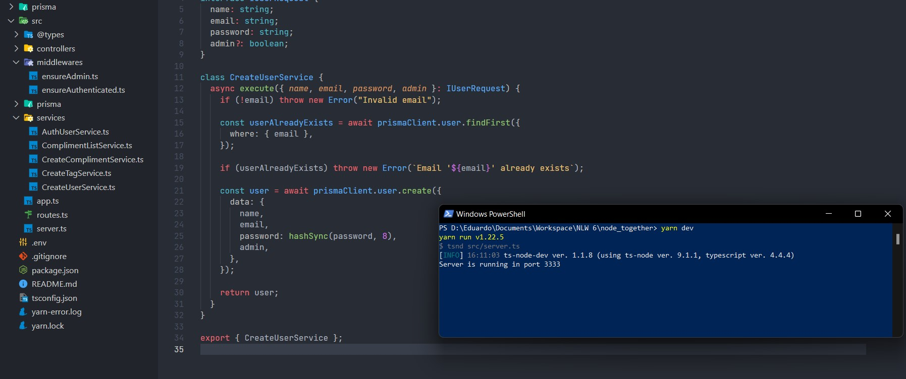

# Next Level Week 6 - Trilha NodeJS

Na edição Next Level Week 6, na trilha de NodeJS, os educadores da plataforma [RocketSeat](https://www.rocketseat.com.br) passaram a criação do projeto NLW Together. Durante o curso, foi realizado a criação do Back-End para o envio de elogios entre usuários, utilizando [NodeJS](https://nodejs.org/pt-br/) e o [Prisma 2](https://www.prisma.io).

# Preparando o ambiente

Para iniciar o projeto é necessário instalado em sua máquina o [NodeJS](https://nodejs.org/pt-br/).

# Back-End

## Dependências

```bash
$ npm install
$ npm prisma migrate dev

ou

$ yarn install
$ yarn prisma migrate dev
```

## Variáveis Ambiente

```bash
APP_PORT= (Porta para rodar o servidor)

APP_KEY = (Hash que será usado na criptografia de autenticação)
```

## Iniciando o servidor

```bash
$ npm run dev

ou

$ yarn dev
```

# Prints do Projeto


